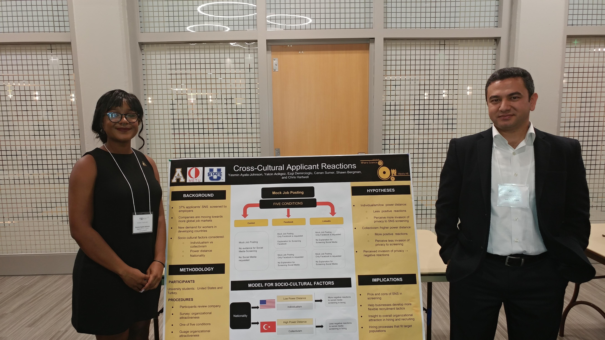

<figure>

</figure> 

The research projects I'm currently working on are apart of Appalachian State's Human Factors Research Team. This team is held under Appstate's department of Psychology and is made up of undergraduate students interested in research and graduate students in the Industrial-Organizational and Human Resource Management (IOHRM) master's program. Over the entire team are two professors, Dr.Yalcin Acikgoz and Dr.Shawn Bergman. 

###Cross Cultural Examination of Applicant Reactions to Social Media Screening

This first research topic was started as an independent studies research project with myself, Dr. Acikgoz, along with two researchers in Turkey, Dr. Ezgi Demircioglu (Middle East Technical University), and Dr. Canan Sumer (Middle East Technical University). 

With the popularity of social media on the rise, it is no surprise that organizations are beginning to use social networking sites SNS to screen applicants in the hiring process. However, the use of SNS screening may lead to negative outcomes in terms of applicant reactions to selection practices (Stoughton, Thompson, & Meade, 2015). With many companies becoming more and more internationalized, and the possibility of negative reactions to SNS screening potentially not being exclusive to applicants based in the U.S., studies examining applicant reactions in different cultural settings is needed. Accordingly, a cross-cultural study was developed to compare applicant reactions to social media screening in the hiring process in which reactions of applicants from two countries, the United States and Turkey, are examined and compared. These two countries are examined because of their differences in important cultural variables such as individualism/collectivism and power distance, which have been proposed to influence applicant reactions to SNS screening (Black, Stone, & Johnson, 2015). In examining applicant reactions, applicants’ perceived invasion of privacy, organizational attraction, and litigation intentions will be used as outcome variables.

This was presented at University of Tennessee Chattanooga, River Cities Industrial- Organizational Conference.This research is currently being written to submit for review. 
To see more it is archived in the [University of Tennessee Chattanooga, River Cities Industrial Organizational Conference](https://scholar.utc.edu/rcio/2017/sessions/34/)

<figure>

</figure>

###Applicant Reactions to Artificial Intelligence in the Selection Process

The use of advanced technology such as artificial intelligence (AI) in the selection process has become an increasingly popular practice within organizations. However, little research has examined how applicants react to these new procedures and how those reactions may affect outcomes such as perceptions of fairness, organizational attraction, and job pursuit intentions. Previous research has suggested that the use of technology in the selection process may lead to more negative outcomes when compared to using traditional selection procedures such as face-to-face interviewing. The purpose of this study is to examine applicant reactions to the use of advanced decision-making technologies in the selection process, such as artificial intelligence systems that make hiring decisions. Determining how applicants react to the use of technology in the selection process serves to help organizations better understand how these practices affect job seekers’ perceptions of the organization. The results of this study may help organizations weigh the pros and cons of using computer information systems to select applicants instead of using a traditional selection procedure.

This was presented at University of Tennessee Chattanooga, River Cities Industrial- Organizational Conference.This research is currently being written to submit for review. 

To see more it is archived in the [University of Tennessee Chattanooga, River Cities Industrial Organizational Conference](https://scholar.utc.edu/rcio/2017/sessions/35/)

<iframe src="A1.pdf" width="100%" height="700px">

