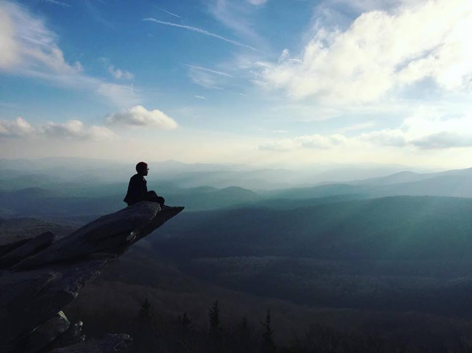

<figure>

Hi, my name is Yasmin Ayala-Johnson. I am currently, in 2018, a student at Appalachian State University. At App I am pursing a Psychology major, business concentration, and double minor in statistics and human resources. 

I know you're probably super interested as to why I have created this website. Primary it was created as part of a class assignment but also because learning to code is ^realLy^ ^cool^ and is worth all the work. I'm also really intrigue by issues pertaining to organizational science and data science. For all these reasons, I created this websites as it stands. 

All the data I'm using is sourced from that which is reported by Google in their yearly demograph reports, or by other reliable sources. If you have any question about my website, including the content, the code, or me please [email me](https://mail.google.com/mail/u/0/#inbox) or connect with me on [LinkedIn](https://www.linkedin.com/in/yasminayalajohnson/)

Not sure how much this will mean to you but these are some of my favorite photos and memes! Enjoy and explore my website friends! 

<figure>

<figure>

<figure>

</figure>